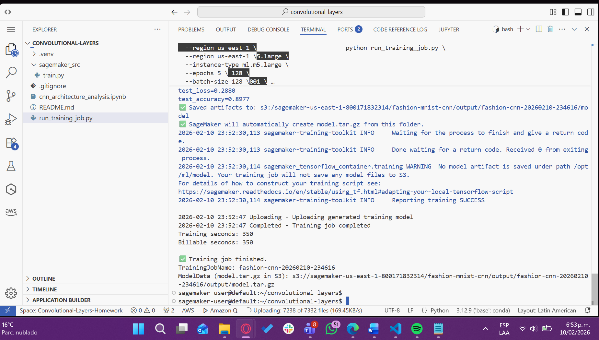
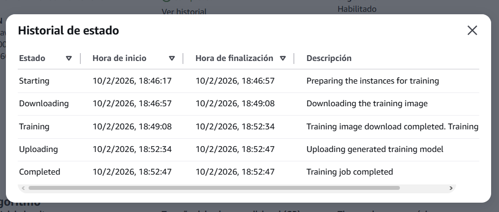

# Convolutional Neural Networks: Architecture Analysis

## Problem Description

This project explores the effectiveness of Convolutional Neural Networks (CNNs) for image classification through systematic experimentation and architectural reasoning. The core objective is to understand **why** convolutional architectures outperform traditional dense networks for visual tasks, rather than simply achieving high accuracy.

The investigation is structured around three main questions:

1. **How does a baseline dense network perform on image data?**
2. **What architectural choices make CNNs effective for this task?**
3. **How does the depth of convolutional layers impact performance?**

The work emphasizes **architectural justification** over hyperparameter tuning, with controlled experiments designed to isolate the impact of specific design decisions.

---

## Dataset Description

### Fashion-MNIST Overview

Fashion-MNIST is a dataset of Zalando's article images, designed as a drop-in replacement for the original MNIST digits dataset. It provides a more challenging classification task while maintaining the same structure.

**Dataset Statistics:**

| Property | Value |
|----------|-------|
| Training samples | 60,000 |
| Test samples | 10,000 |
| Image dimensions | 28 × 28 pixels |
| Channels | 1 (grayscale) |
| Number of classes | 10 |
| Class distribution | Balanced (6,000 per class) |
| Pixel value range | 0–255 (uint8) |

**Classes:**
- T-shirt/top
- Trouser
- Pullover
- Dress
- Coat
- Sandal
- Shirt
- Sneaker
- Bag
- Ankle boot

### Why Fashion-MNIST?

1. **Realistic complexity**: More challenging than MNIST digits, with intra-class variation in style, orientation, and texture
2. **Computational efficiency**: Small enough to train quickly without GPU requirements
3. **Well-established benchmark**: Enables comparison with existing literature
4. **Appropriate scale**: 28×28 resolution is ideal for demonstrating convolutional principles without excessive depth

### Preprocessing

All images were normalized to the range [0, 1] by dividing pixel values by 255. Labels were one-hot encoded for categorical crossentropy loss.

---

## Architecture Diagrams

### Baseline Architecture (Non-Convolutional)

```
Input (28×28)
     ↓
Flatten → 784-dimensional vector
     ↓
Dense(128, ReLU)
     ↓
Dropout(0.3)
     ↓
Dense(64, ReLU)
     ↓
Dropout(0.3)
     ↓
Dense(10, Softmax)
     ↓
Output (10 classes)

Total Parameters: 109,386
```

**Key Limitation**: Flattening destroys spatial structure. The model treats each pixel independently, unable to learn translation-invariant features.

---

### CNN Architecture (3 Convolutional Layers)

```
Input (28×28×1)
     ↓
Conv2D(32, 3×3, ReLU, same padding)
     ↓
BatchNormalization
     ↓
MaxPooling2D(2×2) → 14×14×32
     ↓
Conv2D(64, 3×3, ReLU, same padding)
     ↓
BatchNormalization
     ↓
MaxPooling2D(2×2) → 7×7×64
     ↓
Conv2D(128, 3×3, ReLU, same padding)
     ↓
BatchNormalization
     ↓
MaxPooling2D(2×2) → 3×3×128
     ↓
Flatten → 1,152-dimensional vector
     ↓
Dense(128, ReLU)
     ↓
Dropout(0.3)
     ↓
Dense(64, ReLU)
     ↓
Dropout(0.3)
     ↓
Dense(10, Softmax)
     ↓
Output (10 classes)

Total Parameters: ~201,000
```

### Architectural Justifications

**Convolutional Layers:**
- **Progressive filter increase (32 → 64 → 128)**: As spatial dimensions shrink through pooling, we increase feature map depth to capture richer representations
- **Small kernel size (3×3)**: Balances receptive field size with computational efficiency. Larger kernels would be excessive for 28×28 images
- **Same padding**: Preserves spatial dimensions within each layer, allowing explicit control through pooling

**Pooling Strategy:**
- **MaxPooling (2×2) after each conv block**: Reduces spatial dimensions by 50%, introduces translation invariance, and helps control overfitting
- **Final spatial size (3×3×128)**: Sufficient abstraction before transitioning to dense layers

**Regularization:**
- **BatchNormalization**: Stabilizes training by normalizing activations, enables higher learning rates
- **Dropout (0.3)**: Prevents co-adaptation of neurons in dense layers

---

## Experimental Results

### Experiment: Effect of Convolutional Depth

**Controlled Variables:**
- Kernel size: 3×3
- Activation: ReLU
- Pooling: MaxPooling2D (2×2)
- Dense layers: 128 → 64 → 10
- Optimizer: Adam (lr=0.001)
- Batch size: 128
- Early stopping: patience=5

**Independent Variable:** Number of convolutional layers (1, 2, or 3)

---

### Quantitative Results

| Model | Test Accuracy | Test Loss | Parameters | Training Time |
|-------|---------------|-----------|-----------|---------------|
| Baseline (Dense) | 88.83% | 0.3102 | 109,386 | ~27s |
| 1 Conv Layer | 90.50% | 0.2690 | ~200,000 | ~63s |
| 2 Conv Layers | 90.85% | 0.2557 | ~422,026 | ~102s |
| 3 Conv Layers | 91.77% | 0.2158 | ~897,802 | ~142s |

---

### Key Observations

1. **CNN vs Baseline**: Even a single convolutional layer provides **+1.67% accuracy** over the dense baseline, demonstrating the value of spatial structure preservation

2. **Diminishing Returns**:
   - 1 → 2 layers: **+0.35%** improvement
   - 2 → 3 layers: **+0.92%** improvement
   
   The second convolutional layer yields marginal gains, while the third provides better improvement, suggesting hierarchical feature learning becomes more valuable with depth.

3. **Per-Class Performance** (3-layer CNN):
   - Best: Trouser (99.3% precision), Bag (99.0%)
   - Worst: Shirt (82.5% precision) – confused with T-shirt/Pullover
   - The model struggles with visually similar garment types

4. **Trade-offs**:
   - **Performance**: 3 layers achieve highest accuracy
   - **Complexity**: 3 layers have ~4.4x more parameters than 1 layer
   - **Training Time**: Linear increase with depth (~63s → 102s → 142s)

---

### Visual Analysis

**Training Dynamics:**
- All CNN variants show rapid initial learning (epochs 1-5)
- Validation loss stabilizes earlier in deeper models
- Early stopping frequently triggered around epoch 8-13
- No significant overfitting observed across variants

---

## Interpretation

### Why Do CNNs Outperform Dense Networks?

The superior performance of convolutional architectures stems from three fundamental **inductive biases** that align with the structure of visual data:

#### 1. Locality

**Concept**: Pixels that are spatially close together are more likely to be related than distant pixels.

**How CNNs exploit this**:
- Convolutional filters operate on small local regions (e.g., 3×3 neighborhoods)
- Early layers detect local features (edges, corners)
- Later layers combine these into larger patterns

**Why baseline fails**: Dense layers connect every pixel to every neuron, treating a pixel in the top-left corner as equally important to one adjacent to it. This ignores spatial relationships.

---

#### 2. Translation Invariance

**Concept**: A sneaker in the top-left corner of an image is still a sneaker if moved to the bottom-right.

**How CNNs exploit this**:
- **Weight sharing**: The same filter is applied across the entire image
- Features detected in one location can be recognized anywhere
- Drastically reduces parameters: a 3×3 filter needs only 9 weights regardless of image size

**Why baseline fails**: Dense networks must learn the pattern of a "sneaker" separately for every possible position, wasting parameters and reducing generalization.

---

#### 3. Hierarchical Composition

**Concept**: Complex visual patterns are built from simpler ones.

**How CNNs exploit this**:
- **Layer 1**: Detects edges, lines, simple textures
- **Layer 2**: Combines edges into shapes (collars, sleeves, shoe soles)
- **Layer 3**: Recognizes complete objects (dresses, bags)

This hierarchy emerges naturally through backpropagation, guided by the convolutional structure.

**Why baseline fails**: Dense layers learn all features simultaneously without enforcing compositional structure, leading to less interpretable and less efficient representations.

---

### When Would Convolution NOT Be Appropriate?

Despite their success in computer vision, CNNs are **not universally superior**. Convolution is poorly suited for:

#### 1. Tabular Data

**Example**: Predicting house prices from features like [square footage, number of bedrooms, location, year built]

**Why CNNs fail**:
- No spatial relationship between features
- "Number of bedrooms" being next to "year built" in the feature vector is arbitrary
- Translation invariance is meaningless here

**Better alternative**: Dense networks, gradient boosted trees (XGBoost)

---

#### 2. Graph-Structured Data

**Example**: Social networks, molecular structures, citation networks

**Why CNNs fail**:
- Graphs have irregular, non-grid structure
- Convolutions assume a regular grid (images) or sequence (1D convolutions)
- Neighborhood size varies per node

**Better alternative**: Graph Neural Networks (GNNs)

---

#### 3. Long-Range Dependencies

**Example**: Document classification, time series with distant correlations

**Why CNNs struggle**:
- Receptive field grows slowly with depth
- Capturing dependencies thousands of positions apart requires many layers
- Inefficient compared to alternatives

**Better alternative**: Transformers, RNNs with attention

---

#### 4. Tasks Requiring Global Context

**Example**: Image captioning, scene understanding where overall composition matters more than local details

**Why CNNs are limited**:
- Convolutions analyze local regions
- Global relationships require very deep networks or explicit pooling
- Pooling discards spatial information

**Better alternative**: Vision Transformers, hybrid CNN+Transformer architectures

---

#### 5. Extremely Limited Computational Resources

**Consideration**: CNNs are computationally expensive compared to simpler models

**When to avoid**:
- Embedded systems with severe constraints
- Real-time inference where a simpler model suffices
- Datasets too small to justify the parameter count

**Better alternative**: Lightweight models, pruned networks, or even classical ML if accuracy requirements permit

---

### Optimal Depth for Fashion-MNIST

Based on the experiments:

**Recommendation: 2 convolutional layers**

**Justification**:
- Provides 90.85% accuracy (only 0.92% below 3 layers)
- Significantly fewer parameters (~422K vs ~898K)
- ~30% faster training than 3 layers
- Sufficient abstraction for 28×28 images

**When 3 layers are justified**:
- Maximum accuracy is critical (competitions, benchmarks)
- Computational cost is not a constraint
- Model interpretability benefits from finer hierarchical features

**Why not more?**
- After two pooling operations, spatial dimensions are 7×7
- Further downsampling would lose critical information
- Receptive fields already cover most of the image

---

## AWS SageMaker Training

### Overview

This model was not trained locally. Instead, training was executed as a managed **SageMaker Training Job** using AWS-managed infrastructure and complete lifecycle orchestration.

---

### Training Invocation

The job was launched programmatically using the SageMaker Python SDK via the [`run_training_job.py`](run_training_job.py) script:

```bash
python run_training_job.py \
  --region us-east-1 \
  --instance-type ml.m5.large \
  --epochs 20 \
  --batch-size 128 \
  --learning-rate 0.001 \
  --dropout 0.3 \
  --conv-depth 3 \
  --base-job-name fashion-cnn \
  --s3-prefix fashion-mnist-cnn
```

This execution triggers a **remote training job** on AWS infrastructure, not a local TensorFlow process.

---

### Training Execution Evidence

#### SageMaker Console - Training Job Status

The training job completed successfully with status **Completed**, confirming execution on AWS-managed infrastructure:




**Key observations from the console:**
- Epoch-by-epoch training progress
- Validation accuracy metrics
- Final test metrics
- Model artifact creation confirmation in S3

---

### Training Job Lifecycle

SageMaker automatically managed the complete training lifecycle:

| Phase | Action |
|-------|--------|
| **1. Provisioning** | EC2 instance (`ml.m5.large`) allocated |
| **2. Setup** | Docker container image downloaded and initialized |
| **3. Training** | Model trained for 20 epochs with early stopping |
| **4. Artifact Storage** | Model packaged as `model.tar.gz` and uploaded to S3 |
| **5. Cleanup** | Instance automatically terminated |



---

### Resource Utilization

During training, SageMaker monitored system-level metrics including CPU and memory usage, confirming the workload ran on managed EC2 infrastructure:


**Metrics tracked:**
- CPU utilization
- Memory consumption
- Network I/O
- Disk utilization

---

### Model Artifacts

After training completion, SageMaker automatically packaged all contents under `/opt/ml/model` into a compressed artifact:

**Artifact**: `model.tar.gz`

**S3 Location**:
```
s3://sagemaker-us-east-1-800171832314/
    fashion-mnist-cnn/output/
    fashion-cnn-20260210-234616/output/model.tar.gz
```

**Contents**:
- TensorFlow SavedModel format
- Training metadata (hyperparameters, metrics)
- Class label mappings (`class_names.json`)

---

### Deployment Attempt and Limitation

An attempt was made to deploy the trained model as a real-time SageMaker endpoint. However, deployment **was not completed** due to IAM permission restrictions.

**Error encountered**:
```
AccessDeniedException: User is not authorized to perform
sagemaker:CreateEndpointConfig
```

**Root cause**: The educational AWS environment (LabRole) includes an explicit deny policy for endpoint creation. This limitation is **not related to the model or training code**, but rather to the AWS Academy account restrictions.

**Alternative**: The trained model artifact can be downloaded from S3 and deployed locally or in a different AWS account with appropriate permissions.

---

## Bonus Content

### Visualization of Learned Filters

The notebook includes visualizations of:

1. **First convolutional layer filters (Conv1)**:
   - Edge detectors (horizontal, vertical, diagonal)
   - Blob detectors
   - Texture patterns

2. **Feature map activations**:
   - Input image → Conv1 → Conv2 → Conv3 progression
   - Shows how the network builds hierarchical representations
   - Confirms that early layers detect edges, later layers detect semantic features

These visualizations validate the theoretical understanding of hierarchical feature learning in CNNs.

---

### Confusion Matrix Analysis

Per-class error analysis reveals systematic confusions:

- **Shirt ↔ T-shirt/Pullover**: Visual similarity in upper-body garments
- **Ankle boot ↔ Sneaker**: Both are footwear with similar shapes
- **Coat ↔ Pullover**: Long garments with similar silhouettes

This suggests that further improvements would require:
- Finer-grained features (deeper networks or higher-resolution inputs)
- Data augmentation to increase intra-class diversity
- Attention mechanisms to focus on discriminative regions

---

## Conclusions

This project demonstrates that:

1. **Architectural choices matter more than hyperparameter tuning**: The shift from dense to convolutional layers yielded a larger performance gain than any learning rate or regularization adjustment could provide.

2. **Inductive biases should match data structure**: CNNs excel at images because their biases (locality, translation invariance, hierarchy) align perfectly with visual data properties.

3. **Depth has diminishing returns**: For Fashion-MNIST, 2-3 convolutional layers are optimal. Deeper architectures would not improve performance meaningfully due to the limited input resolution.

4. **Understanding "why" is more valuable than "what"**: The ability to reason about when convolutions are (and are not) appropriate demonstrates deeper understanding than simply achieving high accuracy.

The experimental methodology and architectural reasoning presented here form a foundation for tackling more complex vision tasks with principled design choices.

---

## Repository Structure

```
.
├── cnn_architecture_analysis.ipynb    # Main analysis notebook
├── README.md                           
├── run_training_job.py                 # SageMaker orchestration script
├── sagemaker_src/
│   └── train.py                        # SageMaker training entry point
└── .gitignore
```

---

## How to Run

### Local Training (Notebook)

1. Install dependencies:
   ```bash
   pip install tensorflow numpy matplotlib seaborn scikit-learn
   ```

2. Open Jupyter:
   ```bash
   jupyter notebook cnn_architecture_analysis.ipynb
   ```

3. Run all cells sequentially

---

### SageMaker Training

1. Configure AWS credentials:
   ```bash
   aws configure
   ```

2. Run training job:
   ```bash
   python run_training_job.py \
     --region us-east-1 \
     --instance-type ml.m5.large \
     --epochs 20 \
     --conv-depth 3
   ```

3. Monitor job in SageMaker console or via logs

4. Retrieve model from S3:
   ```bash
   aws s3 cp s3://<bucket>/fashion-mnist-cnn/output/<job-name>/output/model.tar.gz .
   ```

---
